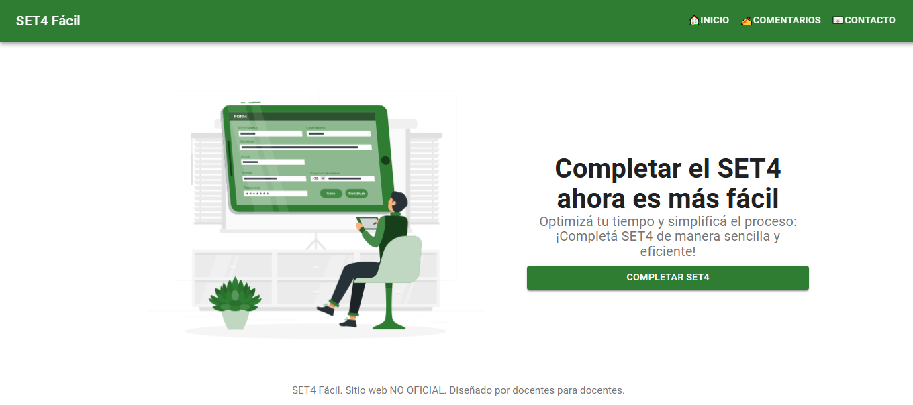

# set4facil 📝

**set4facil** es una aplicación web diseñada para facilitar el llenado del formulario SET4, un documento que los docentes de la Provincia de Buenos Aires debemos entregar todos los años. Esta herramienta busca agilizar el proceso y reducir errores, proporcionando una interfaz clara y fácil de usar.

## 🚀 Características principales

- Interfaz intuitiva y responsiva.
- Carga de datos personales y laborales.
- Generación del formulario SET4 listo para imprimir o enviar.
- Almacenamiento local de datos (sin subir nada a servidores externos).
- Funcionalidad completamente offline tras la primera carga.

## 🖥️ Demo

👉 [Acceder a la demo](https://mterrera29.github.io/set4facil/)

> Puede tardar unos segundos en cargar la primera vez.

## 📸 Capturas

## 🛠️ Tecnologías utilizadas

- **HTML**
- **CSS**
- **JavaScript (Vanilla)**
